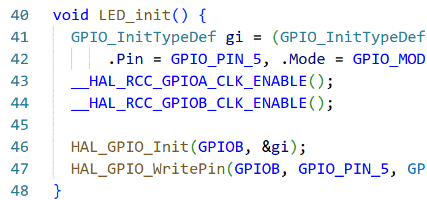

> extracts compile_commands.json from `.uvprojx` file, for further in-stub or in-place uvision project hinting

## demonstration

  
  
arm c highlights swiftly with vscode+clang, supported by compile_commands.json generated by uvhelper

## features

- [x] a bunch of python scripts to extract compile_commands.json from `.uvprojx` file for highlighting
- [x] lightweight, no 3rd party dependencies
- [x] generating stub:
  - [x] able to track and synchronize editions in stub
  - [x] tracks source files, header files and markdowns 
- [ ] resolves non-standard C/C++ contents for highlighting
- [ ] setup.py to install as a package
- [ ] manipulating project configuration

> NOTE: `uvhelper` is born from thin interest; currently targeting only armclang, mdk-arm v6; assumes exclusive occupation of {project_dir}/stub dir; assumes `.uvprojx` file is at {project_dir}.

## motivation

The uVision IDE is widely used in embedded system education while lacks editing capabilities a modern IDE should have, thus demands for `.uvprojx` project highlighting emerges. Meanwhile, the default compiler armclang (and many other task-specific compilers) carries a number of unique features not included in C/C++ standards (e.g. __disable_irg() in MDK and interrupt x in C51) that add difficulties to popular highlighting schemes. For these reasons, `uvhelper` is designed as `.uvprojx`-to-`compile_commands.json` extractor, given that `compile_commands.json` can be recognized by both [IntellSense](https://code.visualstudio.com/docs/editing/intellisense) and [clangd](https://clangd.llvm.org/) to hint C/C++ files' build args.

The idea of 'stub' inherits from [python](https://typing.python.org/en/latest/spec/distributing.html#distributing-type). By mapping a uv project to a stub project, uvhelper separates highlighting and building phases at the cost of copying most of the files to avoid fuzzily manipulating original files.

> NOTE works can be done in-place without stub naturally as long as highlighter can work correctly. specify stub gen_stub with --inplace will only generate a compile_commands.json at {project_dir}.

## prerequisites

- python 3.x

## how to use

- set ARG_KEIL environment variable if requires armclang's std headers
- clone this git under {project_dir}, run `python -m uvhelper <option> ...` at {project_dir},
where option's include:

  - gen_stub: generates stub, meaning to initialize and populate ./stub dir
  - status: to get info about what files in ./stub is modified
  - sync_stub: synchronize changes in stub to project
  - add_target: *not implemented*
  - add_group: *not implemented*
  - add_source: *not implemented* 

- if stub is generated, open a modern editor at {project_dir}/stub to check and take advantage of the editor's highighting.
- if compile_commands is generated in-place, open editor at {project_dir} to check
